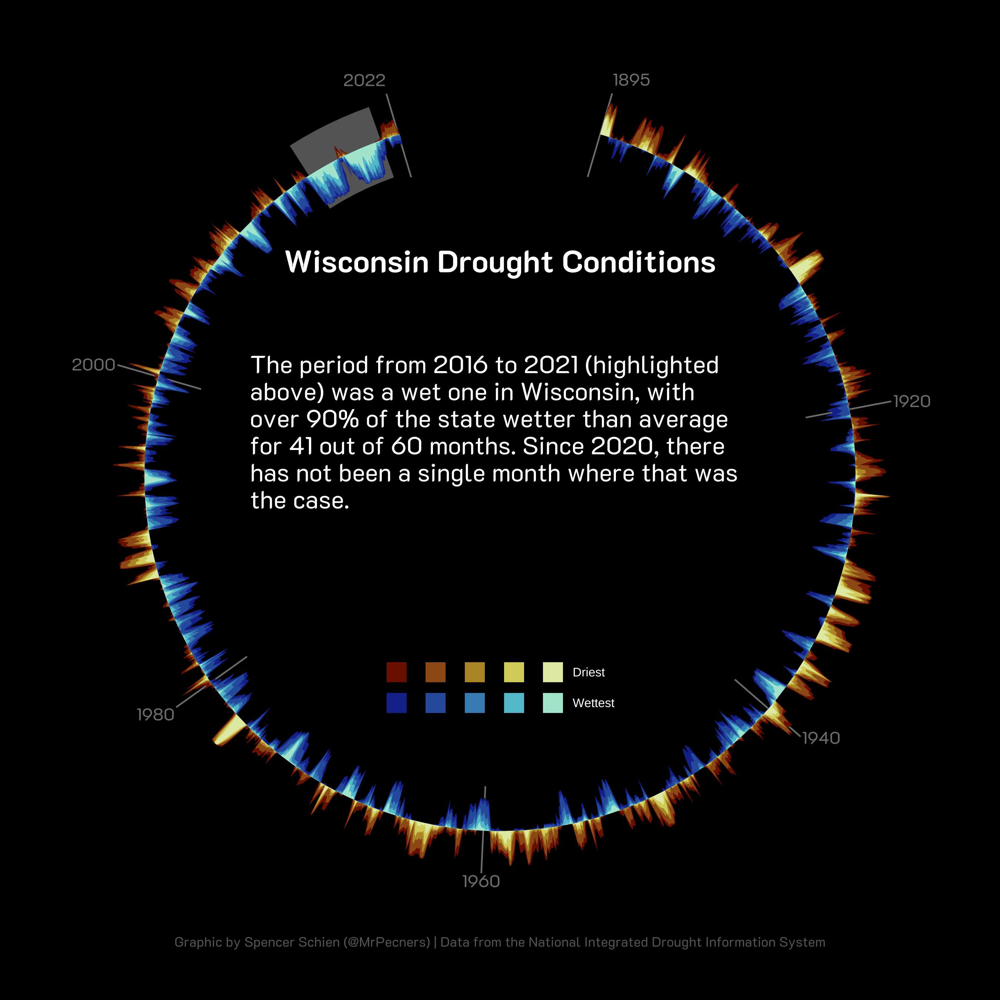
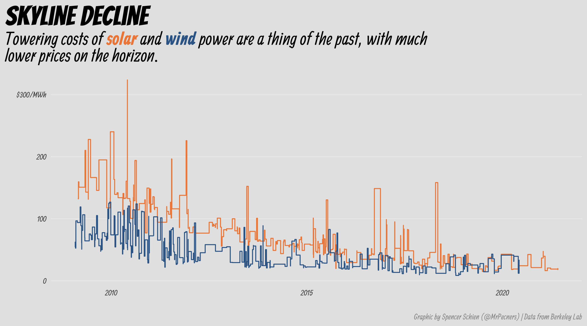
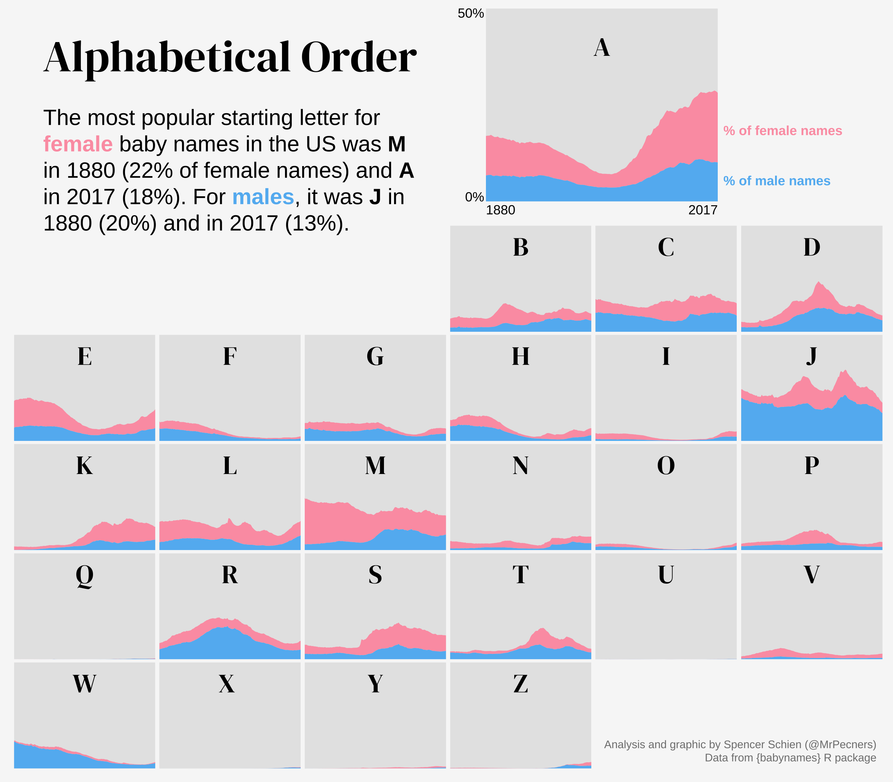

About
================

The purpose of this repo is to house my code and visualization products
for [TidyTuesday](https://github.com/rfordatascience/tidytuesday).

Submissions
================
## [2022-07-26](2022/2022-07-26/final_plot.R)

## [2022-06-14](2022/2022-06-14/final_plot.R)

## [2022-06-07](2022/2022-06-07/final_plot.R)

## [2022-05-31](2022/2022-05-31/final_plot.R)

## [2022-05-17](2022/2022-05-17/final_plot.R)

## [2022-05-10](2022/2022-05-10/final_plot.R)

## [2022-05-03](2022/2022-05-03/final_plot.R)

## [2022-04-19](2022/2022-04-19/final_plot.R)

## [2022-04-12](2022/2022-04-12/final_plot.R)

## [2022-04-05](2022/2022-04-05/final_plot.R)

## [2022-03-29](2022/2022-03-29/final_plot.R)

## [2022-03-22](2022/2022-03-22/final_plot.R)

## [2022-03-15](2022/2022-03-15/final_plot.R)

## [2022-03-08](2022/2022-03-08/final_plot.R)

## [2022-03-01](2022/2022-03-01/final_plot.R)

## [2022-02-22](2022/2022-02-22/final_plot.R)

## [2022-02-15](2022/2022-02-15/final_plot.R)

## [2022-02-08](2022/2022-02-08/final_plot.R)

## [2022-02-01](2022/2022-02-01/final_plot.R)

## [2022-01-25](2022/2022-01-25/final_plot.R)

## [2022-01-18](2022/2022-01-18/final_plot.R)

## [2022-01-11](2022/2022-01-11/final_plot.R)

## [2022-01-04](2022/2022-01-04/final_plot.R)

## [2021-12-21](2021/2021-12-21/final_plot.R)

## [2021-12-14](2021/2021-12-14/final_plot.R)

## [2021-12-07](2021/2021-12-07/final_plot.R)

## [2021-11-23](2021/2021-11-23/final_plot.R)

